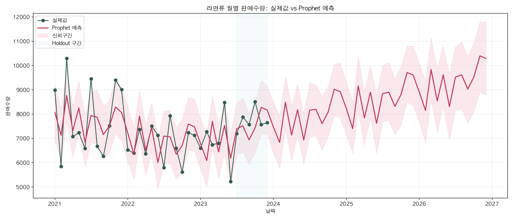
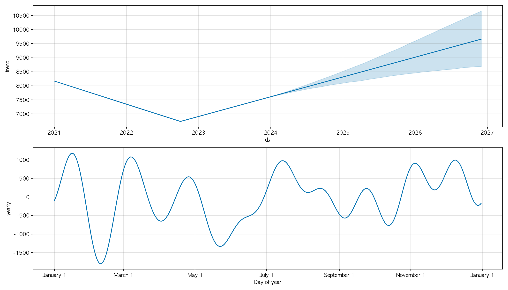

# 라면류 수요예측 파이프라인

[](https://www.python.org/)
[](https://facebook.github.io/prophet/)
[](https://www.mongodb.com/)
[](https://pandas.pydata.org/)

KT AIVLE 리테일 데이터 페스타의 3개년 거래 데이터를 MongoDB로 마이그레이션하고,  
Prophet 하이퍼파라미터 튜닝으로 라면류 월별 수요를 예측하는 엔드-투-엔드 파이프라인.

---

## 파이프라인 흐름

```
data2.xlsx (2021~2023 거래 원본)
  │
  ▼  migrate_to_mongo.py
MongoDB retail_festa.retail_sales
  │  (결측 보정 · 인덱스 구성)
  │
  ▼  DemandForecast/forecast_queries.py
월별 시계열 집계 (MongoDB aggregation)
  │
  ├─▶ DemandForecast/Data2.py         EDA — 소분류 비중, 월별 트렌드, 상위 상품
  │
  └─▶ DemandForecast/prophet_model.py
        │  holdout 분리 (2023 H2)
        │  그리드 탐색 튜닝
        │  성능 비교 (튜닝 Prophet vs 기본 Prophet vs 전년동월 기준선)
        │  전체 데이터 재학습 후 2024~2026 예측
        ▼
      output/  ← CSV · PNG · TXT 자동 저장
```

---

## 결과

| 모델 | RMSE | MAE | MAPE |
|---|---:|---:|---:|
| **튜닝 Prophet** | **1,176.02** | **899.11** | **11.27%** |
| 전년동월 기준선 | 1,395.49 | 1,028.67 | 13.03% |
| 기본 Prophet | 2,765.79 | 2,163.38 | 28.16% |

- 기본 Prophet 대비 MAPE **16.89%p 개선** (상대 개선율 59.98%)
- 전년동월 단순 반복보다도 더 낮은 오차 달성

### 예측 그래프





### Holdout 실제값 vs 예측값 (2023 H2)

| 월 | 실제값 | 튜닝 Prophet |
|---|---:|---:|
| 2023-07 | 7,198 | 7,086.52 |
| 2023-08 | 7,880 | 6,864.82 |
| 2023-09 | 7,564 | 6,094.19 |
| 2023-10 | 8,505 | 6,298.68 |
| 2023-11 | 7,566 | 8,022.76 |
| 2023-12 | 7,647 | 7,782.10 |

---

## 주요 설계 결정

**왜 MongoDB인가**  
연도별 시트가 분리된 Excel을 단순 concat하면 쿼리 유연성이 없다.
MongoDB aggregation pipeline으로 "카테고리 × 월 × 연도" 조합을 자유롭게 집계할 수 있어서 선택했다.
인덱스는 `(판매일)`, `(대분류, 판매일)`, `(연도, 대분류)` 세 개를 구성해 쿼리 속도를 확보했다.

**왜 2023 H2 holdout인가**  
월별 실제값은 내부 데이터 기준 2023년 12월까지만 존재했다.
FIS 공공자료는 면류(냉장) 반기별만 제공해 모델 검증에 사용하기 어려웠다.
그래서 확보 가능한 데이터 안에서 가장 최근 6개월을 holdout으로 분리했다.

**튜닝 방법**  
그리드 탐색(`changepoint_prior_scale` × `seasonality_prior_scale` × `seasonality_mode`) 5개 조합을 holdout MAPE 기준으로 평가했다.
선택된 최종 설정: `cps=0.5`, `sps=0.1`, `mode=additive`

**기준선 비교**  
단순히 Prophet 수치만 제시하면 좋은 건지 나쁜 건지 알 수 없다.
전년동월 기준선(작년 같은 달 값을 그대로 사용)을 baseline으로 설정해 모델이 단순 반복보다 실제로 나은지 검증했다.

---

## 프로젝트 구조

```
.
├── migrate_to_mongo.py          # Excel → MongoDB 마이그레이션
├── data2.xlsx                   # 원본 거래 데이터 (비공개)
├── requirements.txt
└── DemandForecast/
    ├── Data2.py                 # EDA (소분류 비중, 월별 트렌드, 상위 상품)
    ├── forecast_queries.py      # MongoDB aggregation 쿼리 모음
    ├── prophet_model.py         # 메인 파이프라인 (튜닝 → 검증 → 예측)
    ├── validate.py              # RMSE / MAE / MAPE / 기준선 모델
    ├── fis_migrate.py           # FIS PDF → MongoDB 적재 (시장 참고용)
    ├── fis_market_reference.md  # FIS 닐슨아이큐 반기별 시장 분석 노트
    └── output/
        ├── prophet_forecast.png         # 예측 그래프
        ├── prophet_components.png       # 트렌드·계절성 분해
        ├── prophet_forecast.csv         # 2024~2026 월별 예측값
        ├── prophet_holdout_comparison.csv
        ├── prophet_metrics.csv          # 모델별 성능 비교
        ├── prophet_tuning_results.csv   # 그리드 탐색 전 결과
        └── prophet_summary.txt
```

---

## 실행 방법

### 1. 환경 설정

```bash
python -m venv venv
source venv/bin/activate   # Windows: venv\Scripts\activate
pip install -r requirements.txt
```

MongoDB가 로컬에서 실행 중이어야 합니다 (`localhost:27017`).

### 2. 데이터 마이그레이션

```bash
python migrate_to_mongo.py
# → retail_festa.retail_sales 컬렉션에 3개년 데이터 적재
```

### 3. 수요 예측 실행

```bash
python DemandForecast/prophet_model.py
# 기본값: 면류.라면류, holdout 6개월, 미래 36개월 예측

# 옵션 지정 예시
python DemandForecast/prophet_model.py \
  --category "면류.라면류" \
  --holdout-months 6 \
  --future-months 36 \
  --output-dir DemandForecast/output
```

결과 파일은 `DemandForecast/output/` 에 자동 저장됩니다.

### 4. EDA 실행 (선택)

```bash
python DemandForecast/Data2.py
# → 2023년 소분류 비중 파이차트, 월별 트렌드, 상위 10개 상품 출력
```

---

## 기술 스택

| 역할 | 라이브러리 |
|---|---|
| 데이터 처리 | pandas 2.2, openpyxl |
| NoSQL 저장 | pymongo 4.x, MongoDB 7 |
| 시계열 예측 | prophet 1.3 |
| 시각화 | matplotlib 3.9, seaborn 0.13 |
| PDF 파싱 | pdfplumber, tabula-py |
